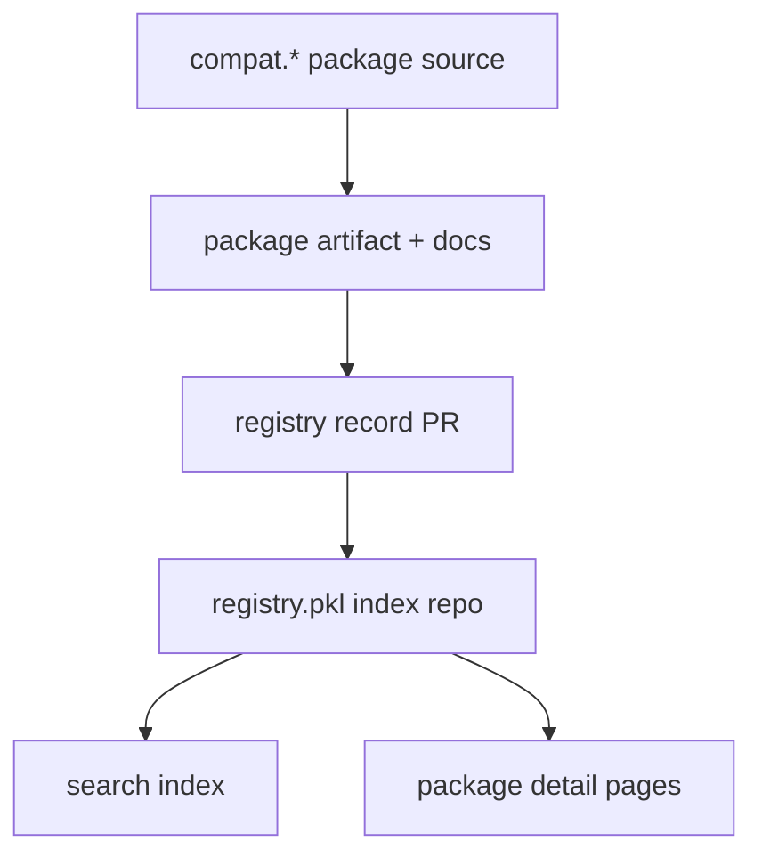

# Architecture

## Two Product Layers

The design is cleaner if you separate the ecosystem into two product layers.

### 1. Package layer

This is the `compat.*` family.

It provides typed Pkl modules that generate existing tool configs.

### 2. Registry layer

This is `registry.pkl`.

It indexes package versions, documentation, and targets through GitHub Pull
Requests.

## High-Level Shape



## Repository Layout

Recommended layout for this repository:

```text
.
|-- .mise.toml
|-- package.pkl
|-- package.json
|-- docs/
|-- crates/
|-- packages/
|   |-- docs/
|   |   |-- package.pkl
|   |   |-- package.json
|   |   |-- content/
|   |   `-- public/
|   |-- core/
|   |-- js/
|   |-- env/
|   |-- rust/
|   |-- editor/
|   |-- agent/
|   `-- ci/
`-- registry/
    |-- records/
    `-- search/
```

## Registry Records

The registry should not duplicate package artifacts.

It should record how to find them and how to search them.

Suggested record fields:

- package name
- version
- package URI
- docs URL
- metadata URL
- zip URL
- targets
- tags
- maintainers
- ecosystem

## Search Facets

Search should support at least:

- package name
- target tool
- file format
- ecosystem
- maintainer
- first-party versus community
- latest only versus all versions

## Critical Constraint

Pkl package distribution already has a real package and metadata model.

`registry.pkl` should layer discovery, review, and search on top of that. It
should not fight the underlying package URI model.

## Implementation Stack

### Programs

If a binary or backend job is needed, prefer Rust.

That includes:

- registry validation
- search indexing
- metadata ingestion
- static page generation helpers
- TOML emission support when a shared library is justified

### Pkl integration

Use `pklrust` as the bridge to Pkl evaluation and protocol-level work.

The registry side will likely need:

- evaluating local modules for validation fixtures
- reading structured output from Pkl
- running project-aware checks

### Docs frontend

The public documentation site itself can stay on `ox-content` because it is a
static docs concern, not a core registry program.
